rajpoot-vikas: I want to create the AI based customer support system where AI bot will call to the customer and answer the calls, I will iniciate the call using the diffrent platforms like RingCentral, Twillio etc, and use realtime speech to text and text to sppech (here also use different services like azure, google, deepgram etc.) and use differnt llm models to answer the query. give me system level architecture and flow diagram, class diagram, etc, for my better understanding give diagrams in mermaid. I will use the typescript or javascript and language. 

GitHub Copilot: I'll help you design a comprehensive AI-based customer support system. Let me break this down into system architecture, flow diagrams, and class diagrams using Mermaid.

## System Architecture

````mermaid
graph TB
    subgraph "Client Layer"
        WEB[Web Interface]
        API[REST API]
        WEBHOOK[Webhook Endpoints]
    end
    
    subgraph "Communication Platforms"
        RC[RingCentral]
        TW[Twilio]
        OTHER[Other Platforms]
    end
    
    subgraph "Core Application Layer"
        CM[Call Manager]
        ASR[Speech-to-Text Service]
        TTS[Text-to-Speech Service]
        LLM[LLM Service]
        CONV[Conversation Manager]
    end
    
    subgraph "AI/ML Services"
        AZURE[Azure Speech]
        GOOGLE[Google Speech]
        DEEPGRAM[Deepgram]
        OPENAI[OpenAI]
        ANTHROPIC[Anthropic]
        GEMINI[Google Gemini]
    end
    
    subgraph "Data Layer"
        CONV_DB[(Conversation DB)]
        USER_DB[(User DB)]
        CONFIG_DB[(Config DB)]
        CACHE[(Redis Cache)]
    end
    
    subgraph "Infrastructure"
        QUEUE[Message Queue]
        STORAGE[File Storage]
        MONITOR[Monitoring]
    end
    
    WEB --> API
    API --> CM
    WEBHOOK --> CM
    
    CM --> RC
    CM --> TW
    CM --> OTHER
    
    CM --> ASR
    CM --> TTS
    CM --> CONV
    
    ASR --> AZURE
    ASR --> GOOGLE
    ASR --> DEEPGRAM
    
    TTS --> AZURE
    TTS --> GOOGLE
    
    CONV --> LLM
    LLM --> OPENAI
    LLM --> ANTHROPIC
    LLM --> GEMINI
    
    CONV --> CONV_DB
    CM --> USER_DB
    CM --> CONFIG_DB
    
    CM --> CACHE
    CM --> QUEUE
    CM --> STORAGE
    
    MONITOR --> CM
    MONITOR --> ASR
    MONITOR --> TTS
    MONITOR --> LLM
````

## System Flow Diagram

````mermaid
sequenceDiagram
    participant Customer
    participant Platform as Communication Platform
    participant CM as Call Manager
    participant ASR as Speech-to-Text
    participant LLM as LLM Service
    participant TTS as Text-to-Speech
    participant DB as Database
    
    Note over Customer, DB: Outbound Call Flow
    
    CM->>Platform: Initiate Call
    Platform->>Customer: Ring Phone
    Customer->>Platform: Answer Call
    Platform->>CM: Call Connected Event
    
    CM->>TTS: Generate Welcome Message
    TTS->>CM: Audio Stream
    CM->>Platform: Play Welcome Audio
    Platform->>Customer: Welcome Message
    
    loop Conversation Loop
        Customer->>Platform: Speak
        Platform->>CM: Audio Stream
        CM->>ASR: Process Audio
        ASR->>CM: Transcribed Text
        
        CM->>DB: Save Customer Message
        CM->>LLM: Generate Response
        Note over LLM: Context + Customer Query
        LLM->>CM: AI Response Text
        
        CM->>TTS: Convert to Speech
        TTS->>CM: Audio Response
        CM->>Platform: Play Response
        Platform->>Customer: AI Response
        
        CM->>DB: Save AI Response
    end
    
    alt Call Ends
        Customer->>Platform: Hang Up
        Platform->>CM: Call Ended Event
        CM->>DB: Update Call Status
    end
````

## Class Diagram

````mermaid
classDiagram
    class CallManager {
        +string callId
        +CallStatus status
        +initiateCall(phoneNumber: string): Promise~Call~
        +handleIncomingCall(callData: CallData): void
        +endCall(callId: string): Promise~void~
        +getCallStatus(callId: string): CallStatus
    }
    
    class CommunicationPlatform {
        <<interface>>
        +makeCall(phoneNumber: string): Promise~Call~
        +handleWebhook(data: any): void
        +sendAudio(callId: string, audio: Buffer): void
        +receiveAudio(callId: string): AudioStream
    }
    
    class RingCentralService {
        +string apiKey
        +string secretKey
        +makeCall(phoneNumber: string): Promise~Call~
        +handleWebhook(data: any): void
        +sendAudio(callId: string, audio: Buffer): void
        +receiveAudio(callId: string): AudioStream
    }
    
    class TwilioService {
        +string accountSid
        +string authToken
        +makeCall(phoneNumber: string): Promise~Call~
        +handleWebhook(data: any): void
        +sendAudio(callId: string, audio: Buffer): void
        +receiveAudio(callId: string): AudioStream
    }
    
    class SpeechToTextService {
        <<interface>>
        +transcribe(audio: Buffer): Promise~string~
        +startRealTimeTranscription(stream: AudioStream): TranscriptionStream
    }
    
    class TextToSpeechService {
        <<interface>>
        +synthesize(text: string): Promise~Buffer~
        +synthesizeStream(text: string): AudioStream
    }
    
    class LLMService {
        <<interface>>
        +generateResponse(context: ConversationContext): Promise~string~
        +streamResponse(context: ConversationContext): ResponseStream
    }
    
    class ConversationManager {
        +string conversationId
        +ConversationContext context
        +addMessage(message: Message): void
        +getContext(): ConversationContext
        +generateResponse(): Promise~string~
        +updateContext(data: any): void
    }
    
    class Call {
        +string id
        +string phoneNumber
        +CallStatus status
        +Date startTime
        +Date endTime
        +ConversationManager conversation
    }
    
    class Message {
        +string id
        +MessageType type
        +string content
        +Date timestamp
        +string speaker
    }
    
    class ConversationContext {
        +string customerId
        +Message[] messages
        +any metadata
        +string intent
    }
    
    class AzureSpeechService {
        +string subscriptionKey
        +string region
        +transcribe(audio: Buffer): Promise~string~
        +synthesize(text: string): Promise~Buffer~
    }
    
    class GoogleSpeechService {
        +string projectId
        +string keyFile
        +transcribe(audio: Buffer): Promise~string~
        +synthesize(text: string): Promise~Buffer~
    }
    
    class DeepgramService {
        +string apiKey
        +transcribe(audio: Buffer): Promise~string~
    }
    
    class OpenAIService {
        +string apiKey
        +string model
        +generateResponse(context: ConversationContext): Promise~string~
    }
    
    CallManager --> CommunicationPlatform
    CallManager --> ConversationManager
    CallManager --> Call
    
    CommunicationPlatform <|-- RingCentralService
    CommunicationPlatform <|-- TwilioService
    
    SpeechToTextService <|-- AzureSpeechService
    SpeechToTextService <|-- GoogleSpeechService
    SpeechToTextService <|-- DeepgramService
    
    TextToSpeechService <|-- AzureSpeechService
    TextToSpeechService <|-- GoogleSpeechService
    
    LLMService <|-- OpenAIService
    
    ConversationManager --> Message
    ConversationManager --> ConversationContext
    ConversationManager --> SpeechToTextService
    ConversationManager --> TextToSpeechService
    ConversationManager --> LLMService
    
    Call --> ConversationManager
````

## Component Architecture

````mermaid
graph LR
    subgraph "API Gateway"
        GATEWAY[Express.js Gateway]
    end
    
    subgraph "Core Services"
        CALL[Call Service]
        CONV[Conversation Service]
        AI[AI Orchestrator]
    end
    
    subgraph "Platform Adapters"
        RC_ADAPTER[RingCentral Adapter]
        TW_ADAPTER[Twilio Adapter]
    end
    
    subgraph "AI Service Adapters"
        STT_ADAPTER[STT Adapter]
        TTS_ADAPTER[TTS Adapter]
        LLM_ADAPTER[LLM Adapter]
    end
    
    subgraph "Data Services"
        USER_SERVICE[User Service]
        CONV_SERVICE[Conversation Store]
        CONFIG_SERVICE[Config Service]
    end
    
    GATEWAY --> CALL
    CALL --> CONV
    CONV --> AI
    
    CALL --> RC_ADAPTER
    CALL --> TW_ADAPTER
    
    AI --> STT_ADAPTER
    AI --> TTS_ADAPTER
    AI --> LLM_ADAPTER
    
    CALL --> USER_SERVICE
    CONV --> CONV_SERVICE
    AI --> CONFIG_SERVICE
````

## Key Implementation Points

### 1. **Modular Design**: Each service (STT, TTS, LLM, Communication Platform) is abstracted behind interfaces for easy swapping.

### 2. **Configuration-Driven**: Provider selection is configuration-based, allowing runtime switching.

### 3. **Event-Driven Architecture**: Uses events for call state changes and real-time communication.

### 4. **Scalable**: Supports multiple concurrent calls with proper resource management.

### 5. **Monitoring**: Built-in monitoring and logging for debugging and performance tracking.

This architecture provides flexibility to use different providers for each service while maintaining a clean, maintainable codebase. The system can handle both inbound and outbound calls, manage conversations contextually, and scale as needed.

rajpoot-vikas: give me more details and project structure for my better underanding of the system.

GitHub Copilot: I'll provide you with a detailed project structure and comprehensive system details for your AI-based customer support system.

````markdown
# AI Customer Support System - Detailed Architecture

## Project Structure

```
ringcentral-4/
├── src/
│   ├── adapters/
│   │   ├── communication/
│   │   │   ├── base/
│   │   │   │   └── CommunicationPlatform.ts
│   │   │   ├── ringcentral/
│   │   │   │   ├── RingCentralAdapter.ts
│   │   │   │   ├── RingCentralWebhook.ts
│   │   │   │   └── types.ts
│   │   │   ├── twilio/
│   │   │   │   ├── TwilioAdapter.ts
│   │   │   │   ├── TwilioWebhook.ts
│   │   │   │   └── types.ts
│   │   │   └── index.ts
│   │   ├── speech/
│   │   │   ├── base/
│   │   │   │   ├── SpeechToTextService.ts
│   │   │   │   └── TextToSpeechService.ts
│   │   │   ├── azure/
│   │   │   │   ├── AzureSTTService.ts
│   │   │   │   ├── AzureTTSService.ts
│   │   │   │   └── types.ts
│   │   │   ├── google/
│   │   │   │   ├── GoogleSTTService.ts
│   │   │   │   ├── GoogleTTSService.ts
│   │   │   │   └── types.ts
│   │   │   ├── deepgram/
│   │   │   │   ├── DeepgramSTTService.ts
│   │   │   │   └── types.ts
│   │   │   └── index.ts
│   │   ├── llm/
│   │   │   ├── base/
│   │   │   │   └── LLMService.ts
│   │   │   ├── openai/
│   │   │   │   ├── OpenAIService.ts
│   │   │   │   └── types.ts
│   │   │   ├── anthropic/
│   │   │   │   ├── AnthropicService.ts
│   │   │   │   └── types.ts
│   │   │   ├── google/
│   │   │   │   ├── GeminiService.ts
│   │   │   │   └── types.ts
│   │   │   └── index.ts
│   │   └── database/
│   │       ├── base/
│   │       │   └── DatabaseAdapter.ts
│   │       ├── mongodb/
│   │       │   └── MongoAdapter.ts
│   │       ├── postgresql/
│   │       │   └── PostgreSQLAdapter.ts
│   │       └── index.ts
│   ├── core/
│   │   ├── call/
│   │   │   ├── CallManager.ts
│   │   │   ├── Call.ts
│   │   │   ├── CallSession.ts
│   │   │   └── types.ts
│   │   ├── conversation/
│   │   │   ├── ConversationManager.ts
│   │   │   ├── Message.ts
│   │   │   ├── ConversationContext.ts
│   │   │   └── types.ts
│   │   ├── ai/
│   │   │   ├── AIOrchestrator.ts
│   │   │   ├── ResponseGenerator.ts
│   │   │   ├── IntentClassifier.ts
│   │   │   └── types.ts
│   │   ├── audio/
│   │   │   ├── AudioProcessor.ts
│   │   │   ├── AudioStream.ts
│   │   │   ├── AudioBuffer.ts
│   │   │   └── types.ts
│   │   └── events/
│   │       ├── EventEmitter.ts
│   │       ├── CallEvents.ts
│   │       └── types.ts
│   ├── services/
│   │   ├── user/
│   │   │   ├── UserService.ts
│   │   │   ├── UserRepository.ts
│   │   │   └── types.ts
│   │   ├── conversation/
│   │   │   ├── ConversationService.ts
│   │   │   ├── ConversationRepository.ts
│   │   │   └── types.ts
│   │   ├── config/
│   │   │   ├── ConfigService.ts
│   │   │   ├── ProviderConfig.ts
│   │   │   └── types.ts
│   │   ├── auth/
│   │   │   ├── AuthService.ts
│   │   │   ├── JWTService.ts
│   │   │   └── types.ts
│   │   ├── monitoring/
│   │   │   ├── MetricsService.ts
│   │   │   ├── LoggingService.ts
│   │   │   └── types.ts
│   │   └── cache/
│   │       ├── CacheService.ts
│   │       ├── RedisCache.ts
│   │       └── types.ts
│   ├── api/
│   │   ├── routes/
│   │   │   ├── calls.ts
│   │   │   ├── conversations.ts
│   │   │   ├── users.ts
│   │   │   ├── config.ts
│   │   │   ├── webhooks.ts
│   │   │   └── health.ts
│   │   ├── middleware/
│   │   │   ├── auth.ts
│   │   │   ├── validation.ts
│   │   │   ├── errorHandler.ts
│   │   │   ├── rateLimit.ts
│   │   │   └── logging.ts
│   │   ├── controllers/
│   │   │   ├── CallController.ts
│   │   │   ├── ConversationController.ts
│   │   │   ├── UserController.ts
│   │   │   ├── ConfigController.ts
│   │   │   └── WebhookController.ts
│   │   └── app.ts
│   ├── utils/
│   │   ├── audio/
│   │   │   ├── AudioUtils.ts
│   │   │   ├── Converter.ts
│   │   │   └── Validator.ts
│   │   ├── http/
│   │   │   ├── HttpClient.ts
│   │   │   └── RetryClient.ts
│   │   ├── validation/
│   │   │   ├── Schemas.ts
│   │   │   └── Validator.ts
│   │   ├── encryption/
│   │   │   ├── Crypto.ts
│   │   │   └── TokenManager.ts
│   │   └── common/
│   │       ├── Logger.ts
│   │       ├── Constants.ts
│   │       ├── Helpers.ts
│   │       └── Types.ts
│   ├── config/
│   │   ├── database.ts
│   │   ├── redis.ts
│   │   ├── providers.ts
│   │   ├── server.ts
│   │   └── environment.ts
│   ├── models/
│   │   ├── User.ts
│   │   ├── Call.ts
│   │   ├── Conversation.ts
│   │   ├── Message.ts
│   │   └── Config.ts
│   ├── types/
│   │   ├── api.ts
│   │   ├── call.ts
│   │   ├── conversation.ts
│   │   ├── providers.ts
│   │   └── common.ts
│   └── index.ts
├── tests/
│   ├── unit/
│   │   ├── adapters/
│   │   ├── core/
│   │   ├── services/
│   │   └── utils/
│   ├── integration/
│   │   ├── api/
│   │   ├── database/
│   │   └── providers/
│   ├── e2e/
│   │   ├── call-flow.test.ts
│   │   ├── conversation.test.ts
│   │   └── providers.test.ts
│   └── fixtures/
│       ├── audio/
│       ├── data/
│       └── mocks/
├── docs/
│   ├── api/
│   │   └── openapi.yaml
│   ├── deployment/
│   │   ├── docker/
│   │   ├── kubernetes/
│   │   └── aws/
│   ├── guides/
│   │   ├── setup.md
│   │   ├── configuration.md
│   │   └── troubleshooting.md
│   └── architecture.md
├── scripts/
│   ├── build.sh
│   ├── deploy.sh
│   ├── test.sh
│   └── migrate.sh
├── docker/
│   ├── Dockerfile
│   ├── docker-compose.yml
│   └── docker-compose.dev.yml
├── k8s/
│   ├── deployment.yaml
│   ├── service.yaml
│   ├── configmap.yaml
│   └── ingress.yaml
├── package.json
├── tsconfig.json
├── jest.config.js
├── .env.example
├── .gitignore
└── README.md
```

## Detailed System Components

### 1. Communication Flow Architecture

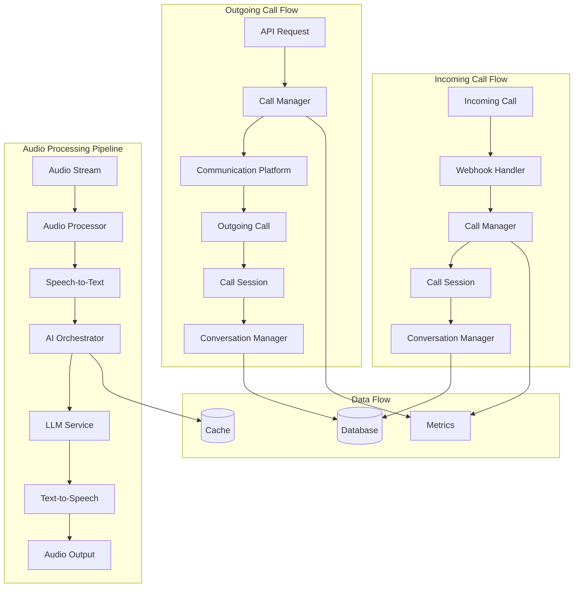

### 2. Service Integration Architecture

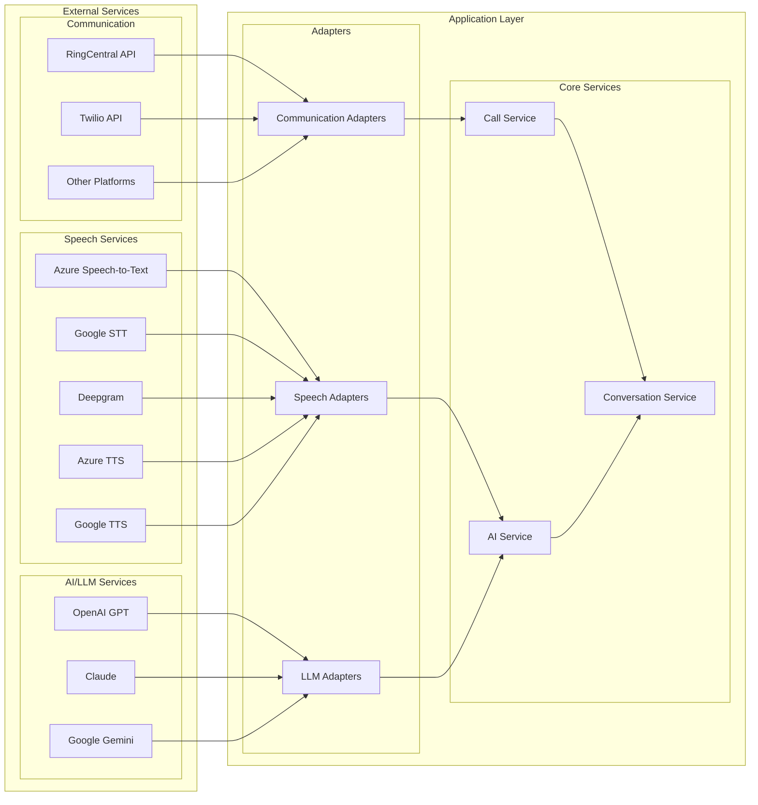

### 3. Database Schema Design

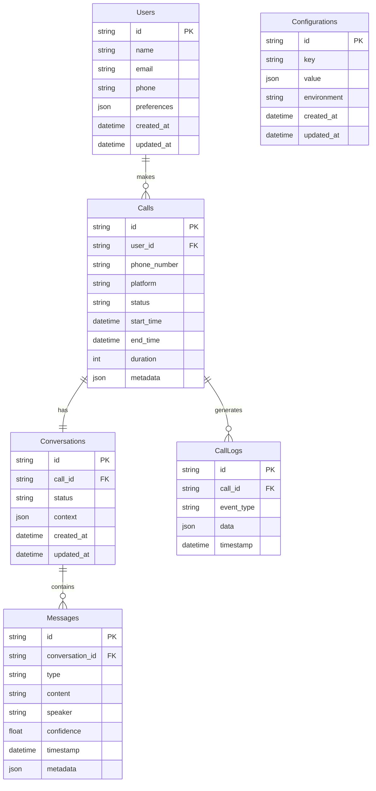

### 4. Real-time Processing Flow

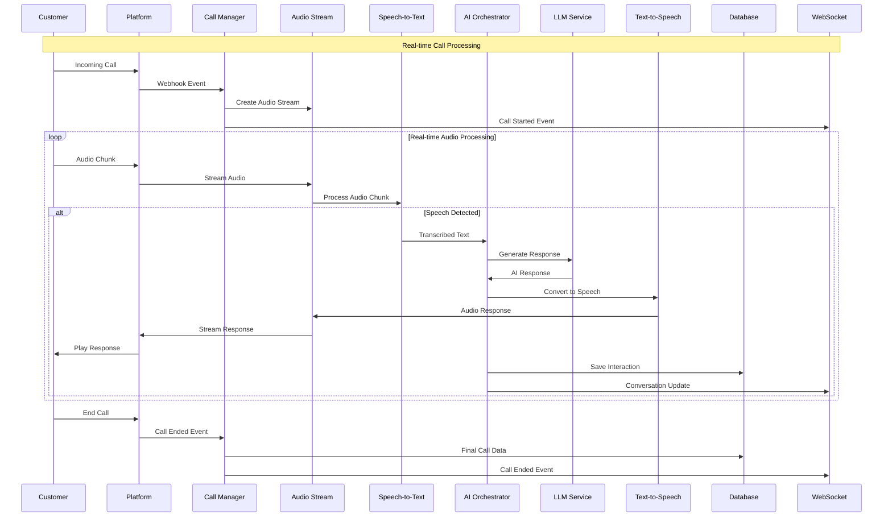

### 5. Configuration Management

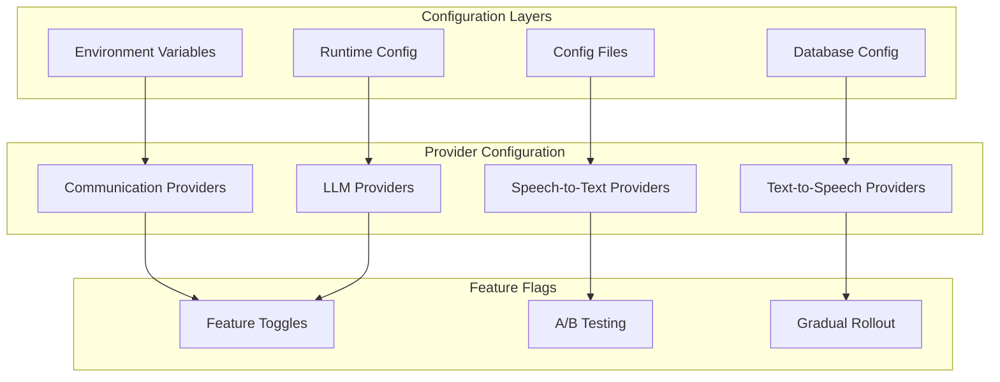

### 6. Monitoring and Observability

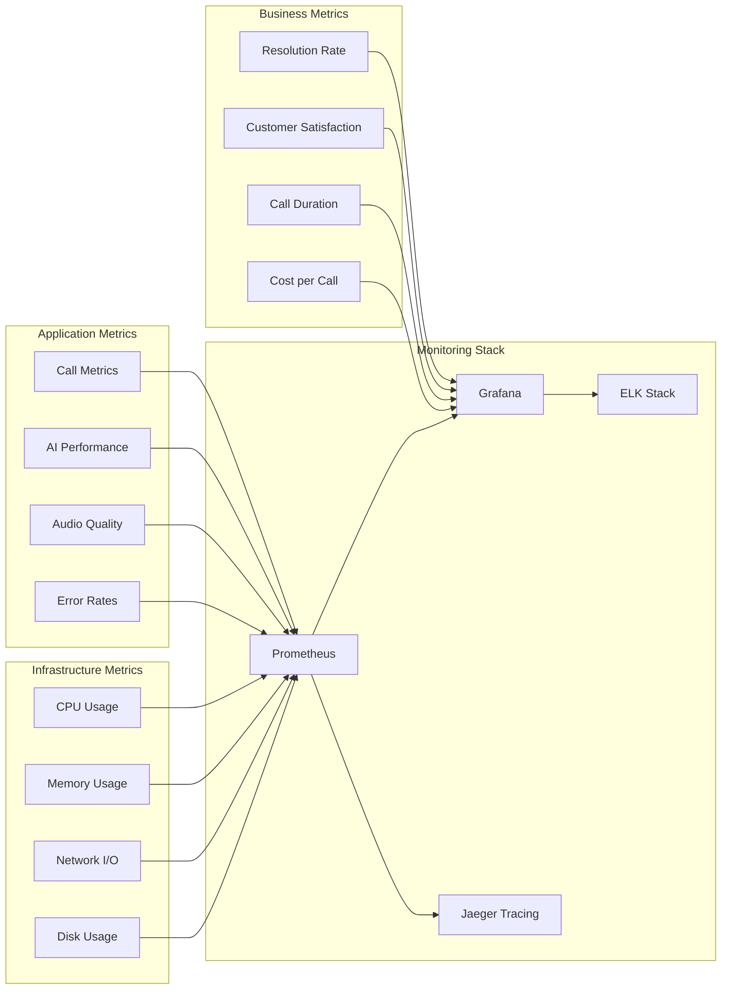

### 7. Deployment Architecture

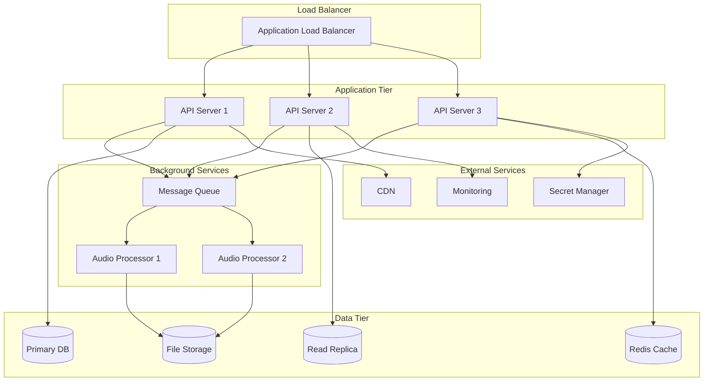

## Key Implementation Details

### Technology Stack
- **Runtime**: Node.js with TypeScript
- **Framework**: Express.js for REST API
- **Database**: MongoDB/PostgreSQL with connection pooling
- **Cache**: Redis for session management
- **Message Queue**: AWS SQS or Redis Pub/Sub
- **Audio Processing**: Node.js streams with FFmpeg
- **Real-time**: WebSocket for live updates
- **Monitoring**: Prometheus + Grafana
- **Deployment**: Docker + Kubernetes

### Performance Considerations
- **Concurrent Calls**: Support for 1000+ simultaneous calls
- **Audio Latency**: <200ms end-to-end response time
- **Scalability**: Horizontal scaling with load balancing
- **Reliability**: 99.9% uptime with failover mechanisms
- **Security**: End-to-end encryption for audio streams

### Configuration-Driven Design
- **Runtime Provider Switching**: Change providers without code deployment
- **A/B Testing**: Test different AI models simultaneously
- **Feature Flags**: Gradual rollout of new features
- **Cost Optimization**: Route calls to most cost-effective providers
````

This comprehensive architecture provides a solid foundation for building your AI customer support system with flexibility, scalability, and maintainability in mind.

rajpoot-vikas: give me details on the technology and system design. and give best suggestion for realtime conversation. 

GitHub Copilot: I'll provide detailed technology specifications and system design recommendations with a focus on real-time conversation capabilities.

````markdown
<!-- ...existing code... -->

## Technology Stack Details & Real-time Conversation Design

### Core Technology Recommendations

#### 1. **Real-time Audio Processing Stack**
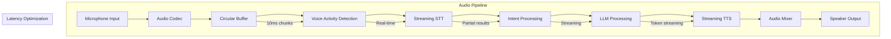

#### 2. **Technology Stack by Layer**

**Audio Processing Layer:**
- **WebRTC**: For low-latency audio streaming (< 150ms)
- **Opus Codec**: Superior audio quality at low bitrates
- **FFmpeg**: Audio format conversion and processing
- **Node.js Streams**: Non-blocking audio pipeline

**Real-time Communication:**
- **Socket.IO**: WebSocket with fallbacks for real-time events
- **Redis Pub/Sub**: Message broadcasting across instances
- **Server-Sent Events (SSE)**: For one-way real-time updates

**Speech Processing:**
- **Streaming STT**: Google Cloud Speech (Streaming API), Azure Speech, Deepgram
- **Voice Activity Detection**: WebRTC VAD or custom implementation
- **Audio Chunking**: 10ms-100ms chunks for minimal latency

### Real-time Conversation Architecture

#### 1. **Bidirectional Streaming Design**
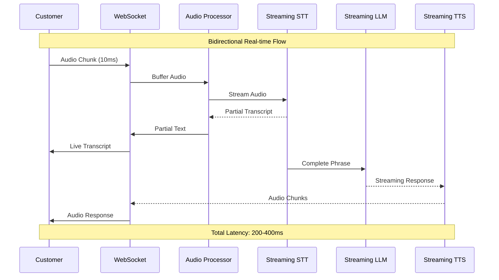

#### 2. **Voice Activity Detection & Turn Management**
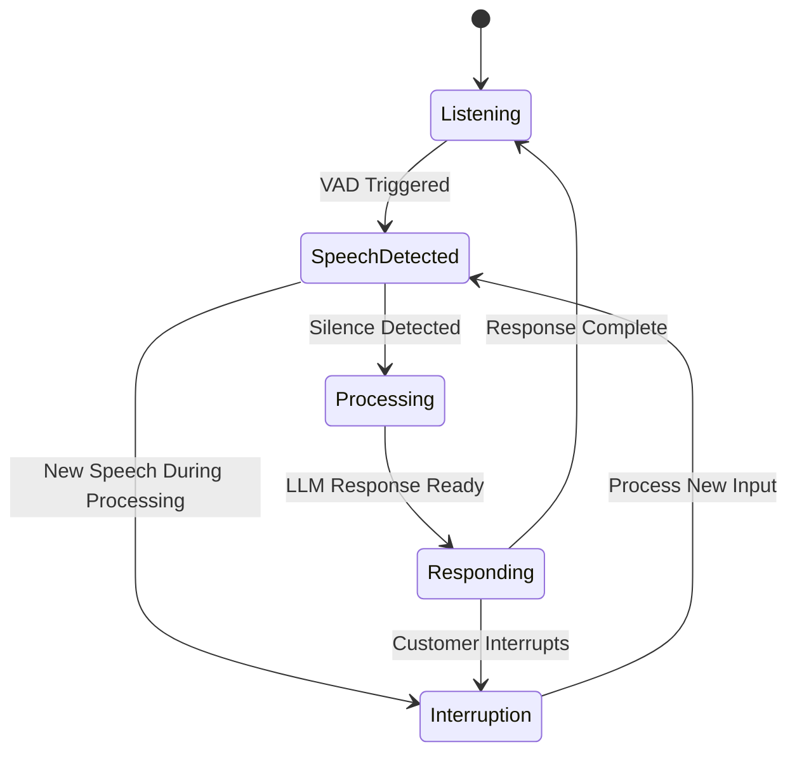

### Recommended Technology Choices

#### **1. Communication Platforms (Best to Worst for Real-time)**

| Platform | Latency | Audio Quality | WebSocket Support | Streaming | Cost |
|----------|---------|---------------|-------------------|-----------|------|
| **Twilio** | ⭐⭐⭐⭐⭐ | ⭐⭐⭐⭐⭐ | ✅ Native | ✅ Excellent | ⭐⭐⭐ |
| **RingCentral** | ⭐⭐⭐⭐ | ⭐⭐⭐⭐ | ✅ Good | ✅ Good | ⭐⭐⭐⭐ |
| **Vonage** | ⭐⭐⭐ | ⭐⭐⭐⭐ | ✅ Basic | ⭐⭐⭐ | ⭐⭐⭐⭐ |

**Recommendation**: **Twilio** for best real-time performance

#### **2. Speech-to-Text Services (Real-time Performance)**

| Service | Latency | Accuracy | Streaming | Languages | Cost |
|---------|---------|----------|-----------|-----------|------|
| **Deepgram** | ⭐⭐⭐⭐⭐ | ⭐⭐⭐⭐⭐ | ✅ Excellent | ⭐⭐⭐⭐ | ⭐⭐⭐⭐ |
| **Google Cloud** | ⭐⭐⭐⭐ | ⭐⭐⭐⭐⭐ | ✅ Good | ⭐⭐⭐⭐⭐ | ⭐⭐⭐ |
| **Azure Speech** | ⭐⭐⭐⭐ | ⭐⭐⭐⭐ | ✅ Good | ⭐⭐⭐⭐ | ⭐⭐⭐ |
| **AWS Transcribe** | ⭐⭐⭐ | ⭐⭐⭐⭐ | ✅ Basic | ⭐⭐⭐ | ⭐⭐⭐⭐ |

**Recommendation**: **Deepgram** for lowest latency, **Google Cloud** for accuracy

#### **3. Text-to-Speech Services (Real-time Performance)**

| Service | Latency | Voice Quality | Streaming | Emotions | Cost |
|---------|---------|---------------|-----------|----------|------|
| **ElevenLabs** | ⭐⭐⭐⭐⭐ | ⭐⭐⭐⭐⭐ | ✅ Excellent | ⭐⭐⭐⭐⭐ | ⭐⭐ |
| **Azure Speech** | ⭐⭐⭐⭐ | ⭐⭐⭐⭐ | ✅ Good | ⭐⭐⭐⭐ | ⭐⭐⭐ |
| **Google Cloud** | ⭐⭐⭐⭐ | ⭐⭐⭐⭐ | ✅ Good | ⭐⭐⭐ | ⭐⭐⭐ |
| **OpenAI TTS** | ⭐⭐⭐ | ⭐⭐⭐⭐ | ❌ Batch | ⭐⭐⭐ | ⭐⭐⭐⭐ |

**Recommendation**: **ElevenLabs** for quality, **Azure** for balance

#### **4. LLM Services (Streaming Capability)**

| Service | Latency | Streaming | Context | Cost | Reliability |
|---------|---------|-----------|---------|------|-------------|
| **OpenAI GPT-4** | ⭐⭐⭐⭐ | ✅ Excellent | 128k | ⭐⭐ | ⭐⭐⭐⭐⭐ |
| **Anthropic Claude** | ⭐⭐⭐⭐ | ✅ Excellent | 200k | ⭐⭐ | ⭐⭐⭐⭐⭐ |
| **Google Gemini** | ⭐⭐⭐⭐⭐ | ✅ Good | 1M | ⭐⭐⭐ | ⭐⭐⭐⭐ |
| **Groq** | ⭐⭐⭐⭐⭐ | ✅ Excellent | 32k | ⭐⭐⭐⭐ | ⭐⭐⭐ |

**Recommendation**: **Groq** for ultra-low latency, **Claude** for quality

### Real-time System Design Patterns

#### **1. Audio Streaming Pipeline**
```typescript
interface AudioPipeline {
  input: AudioInputStream;
  vad: VoiceActivityDetector;
  stt: StreamingSTTService;
  llm: StreamingLLMService;
  tts: StreamingTTSService;
  output: AudioOutputStream;
}

class RealTimeConversation {
  private pipeline: AudioPipeline;
  
  async processAudioChunk(chunk: AudioChunk): Promise<void> {
    // Voice Activity Detection
    if (this.pipeline.vad.detectSpeech(chunk)) {
      // Stream to STT
      const partialText = await this.pipeline.stt.streamAudio(chunk);
      
      // If complete phrase detected
      if (partialText.isFinal) {
        // Stream to LLM
        const responseStream = this.pipeline.llm.streamResponse(partialText.text);
        
        // Stream to TTS
        for await (const token of responseStream) {
          const audioChunk = await this.pipeline.tts.streamSynthesize(token);
          this.pipeline.output.write(audioChunk);
        }
      }
    }
  }
}
```

#### **2. Interrupt Handling System**
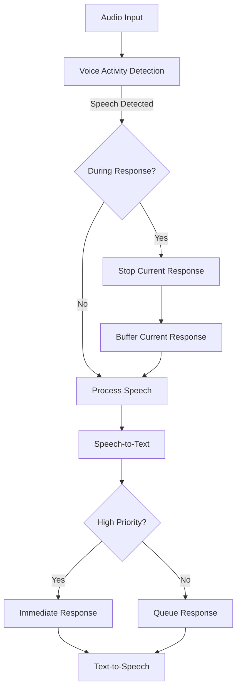

#### **3. Latency Optimization Strategies**

**Audio Chunking:**
```typescript
const OPTIMAL_CHUNK_SIZES = {
  input: 10, // 10ms for VAD
  stt: 100,  // 100ms for STT
  llm: 'streaming', // Token by token
  tts: 50    // 50ms for TTS
};
```

**Predictive Processing:**
```typescript
class PredictiveProcessor {
  async preprocessLikelyResponses(context: ConversationContext): Promise<void> {
    const likelyIntents = await this.intentPredictor.predict(context);
    
    // Pre-generate common responses
    for (const intent of likelyIntents) {
      const response = await this.llm.generateResponse(intent);
      this.responseCache.set(intent.id, response);
    }
  }
}
```

### Infrastructure for Real-time Performance

#### **1. Edge Computing Architecture**
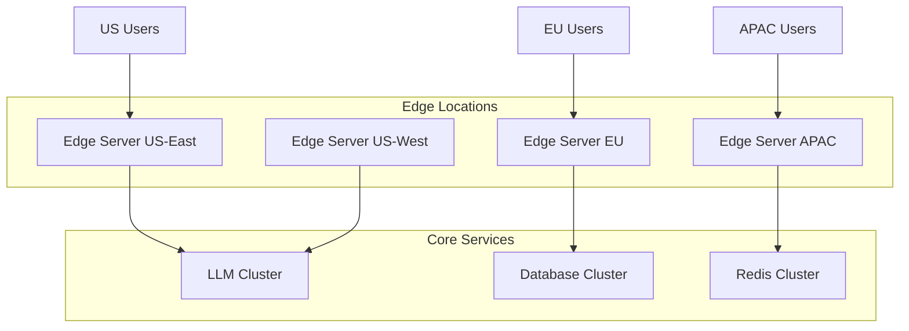

#### **2. Performance Targets**

| Metric | Target | Monitoring |
|--------|--------|------------|
| **Audio Latency** | < 50ms | WebRTC stats |
| **STT Latency** | < 100ms | Response time |
| **LLM Latency** | < 200ms | Token streaming |
| **TTS Latency** | < 100ms | First audio byte |
| **End-to-End** | < 400ms | Full pipeline |
| **Jitter** | < 20ms | Network stability |
| **Packet Loss** | < 0.1% | Connection quality |

#### **3. Scaling Strategy**
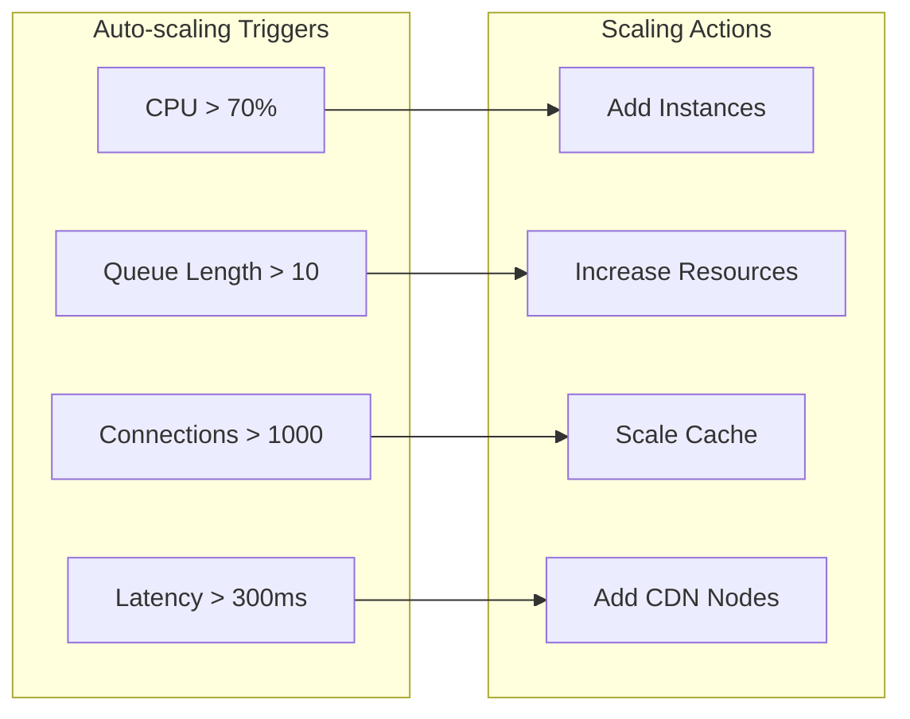

### Best Practices for Real-time Conversations

#### **1. Audio Quality Optimization**
- Use **Opus codec** at 16kHz/16-bit for optimal quality/bandwidth
- Implement **adaptive bitrate** based on connection quality
- Use **noise suppression** and **echo cancellation**
- Implement **jitter buffer** for smooth playback

#### **2. Conversation Flow Management**
- **Turn-taking detection** with silence thresholds
- **Interrupt handling** with graceful response switching
- **Context preservation** during interruptions
- **Conversation state management**

#### **3. Fallback Strategies**
- **Graceful degradation** when services are slow
- **Pre-computed responses** for common queries
- **Local processing** for critical path operations
- **Circuit breakers** for external service failures

#### **4. Monitoring & Analytics**
```typescript
interface RealTimeMetrics {
  audioLatency: number;
  sttLatency: number;
  llmLatency: number;
  ttsLatency: number;
  endToEndLatency: number;
  jitter: number;
  packetLoss: number;
  interruptionRate: number;
  conversationQuality: number;
}
```

This design provides a robust foundation for real-time AI conversations with sub-400ms latency and natural interaction patterns.
````

rajpoot-vikas: don't start coding give more clearty on design aspects only.

GitHub Copilot: I'll provide more detailed design aspects focusing on architecture, patterns, and system design principles without code implementation.

````markdown
## Advanced System Design Aspects

### Real-time Conversation Design Philosophy

#### **1. Conversational AI Design Patterns**

**Turn-Based vs. Interrupt-Driven Conversation**
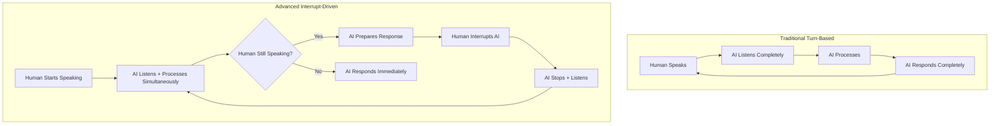

**Conversation State Management**
- **Active Listening State**: Continuously processing audio input
- **Processing State**: Analyzing intent while maintaining audio buffer
- **Response Generation State**: LLM processing with partial response streaming
- **Speaking State**: TTS output with interrupt monitoring
- **Interruption Handling State**: Graceful transition between states

#### **2. Audio Processing Design Patterns**

**Streaming vs. Batch Processing**
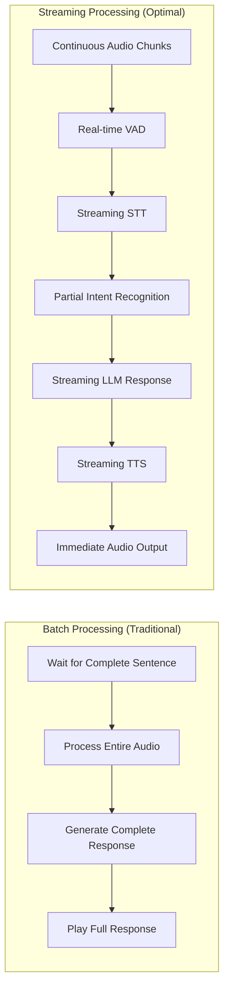

**Audio Buffer Management Strategy**
- **Circular Buffer Design**: Maintains last N seconds of audio for context
- **Multi-tier Buffering**: Different buffer sizes for different processing stages
- **Adaptive Buffering**: Dynamic buffer sizing based on network conditions
- **Compression Strategy**: Real-time audio compression for bandwidth optimization

### Communication Platform Integration Design

#### **1. Platform Abstraction Strategy**

**Multi-Platform Support Architecture**
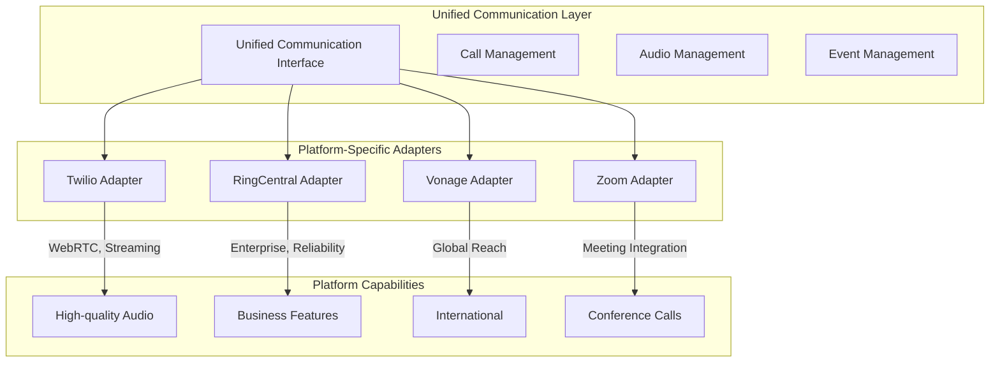

**Platform Selection Strategy**
- **Geographic Routing**: Route calls based on customer location
- **Cost Optimization**: Dynamic platform selection based on cost models
- **Quality Metrics**: Real-time platform performance monitoring
- **Failover Mechanism**: Automatic switching during platform outages

#### **2. Webhook Management Design**

**Event-Driven Architecture**
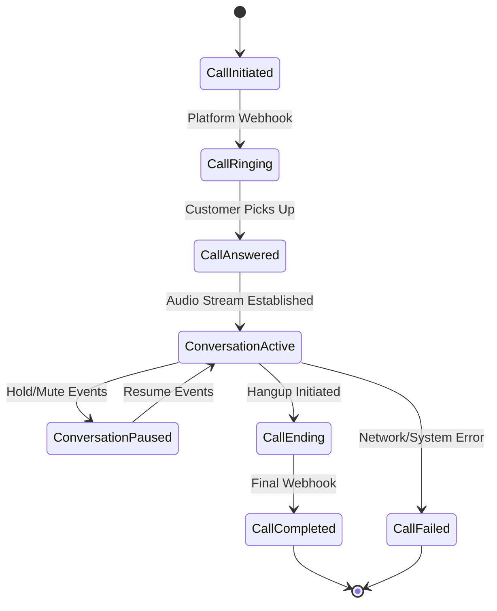

### AI Service Integration Design

#### **1. Multi-Provider AI Strategy**

**Load Balancing & Failover for AI Services**
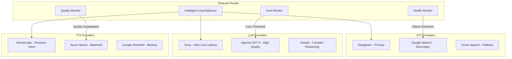

**Provider Selection Criteria**
- **Latency Requirements**: Ultra-low (<100ms) vs. Standard (<500ms)
- **Quality Requirements**: Premium vs. Standard voice quality
- **Cost Constraints**: Budget-based provider selection
- **Regional Compliance**: Data sovereignty requirements
- **Feature Requirements**: Emotion detection, multiple languages

#### **2. Context Management Design**

**Conversation Context Architecture**
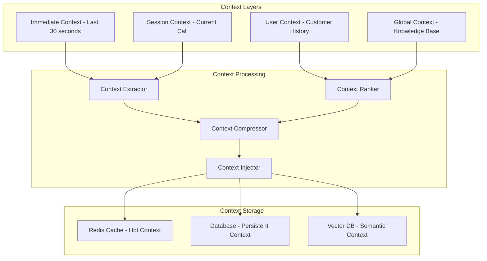

### Data Architecture Design

#### **1. Multi-Database Strategy**

**Polyglot Persistence Design**
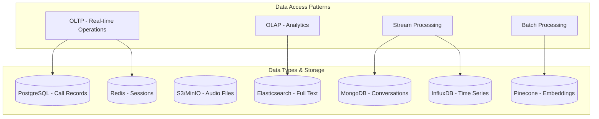

**Data Partitioning Strategy**
- **Temporal Partitioning**: Partition by call date/time
- **Geographic Partitioning**: Region-based data distribution
- **Customer Partitioning**: High-volume customer isolation
- **Feature-based Partitioning**: Separate hot and cold data

#### **2. Real-time Data Pipeline**

**Stream Processing Architecture**
```mermaid
graph LR
    subgraph "Data Ingestion"
        AUDIO_STREAM[Audio Streams]
        EVENT_STREAM[Platform Events]
        METRICS_STREAM[System Metrics]
    end
    
    subgraph "Stream Processing"
        KAFKA[Apache Kafka]
        KINESIS[AWS Kinesis]
        PUBSUB[Google Pub/Sub]
    end
    
    subgraph "Processing Engines"
        SPARK[Spark Streaming]
        FLINK[Apache Flink]
        STORM[Apache Storm]
    end
    
    subgraph "Output Sinks"
        REALTIME_DB[Real-time Database]
        ANALYTICS_DB[Analytics Database]
        ALERT_SYSTEM[Alert System]
    end
    
    AUDIO_STREAM --> KAFKA
    EVENT_STREAM --> KINESIS
    METRICS_STREAM --> PUBSUB
    
    KAFKA --> SPARK
    KINESIS --> FLINK
    PUBSUB --> STORM
    
    SPARK --> REALTIME_DB
    FLINK --> ANALYTICS_DB
    STORM --> ALERT_SYSTEM
```

### Scalability Design Patterns

#### **1. Horizontal Scaling Architecture**

**Service Mesh & Microservices**
```mermaid
graph TB
    subgraph "Service Mesh Layer"
        ISTIO[Istio Service Mesh]
        ENVOY[Envoy Proxy]
        CONSUL[Consul Connect]
    end
    
    subgraph "Microservices"
        CALL_SVC[Call Service]
        AUDIO_SVC[Audio Processing Service]
        AI_SVC[AI Orchestration Service]
        USER_SVC[User Service]
        CONFIG_SVC[Configuration Service]
    end
    
    subgraph "Infrastructure"
        K8S[Kubernetes Cluster]
        DOCKER[Docker Containers]
        HELM[Helm Charts]
    end
    
    ISTIO --> CALL_SVC
    ENVOY --> AUDIO_SVC
    CONSUL --> AI_SVC
    
    CALL_SVC --> K8S
    AUDIO_SVC --> DOCKER
    AI_SVC --> HELM
```

**Auto-scaling Strategies**
- **Predictive Scaling**: ML-based capacity prediction
- **Reactive Scaling**: Metrics-based scaling triggers
- **Scheduled Scaling**: Time-based capacity adjustments
- **Circuit Breaker Pattern**: Prevent cascade failures

#### **2. Geographic Distribution**

**Multi-Region Deployment Strategy**
```mermaid
graph TB
    subgraph "Global Load Balancer"
        GLB[CloudFlare/AWS Global Accelerator]
    end
    
    subgraph "US-East Region"
        USE_LB[Regional Load Balancer]
        USE_API[API Servers]
        USE_WORKER[Audio Workers]
        USE_DB[(Regional Database)]
    end
    
    subgraph "EU-West Region"
        EUW_LB[Regional Load Balancer]
        EUW_API[API Servers]
        EUW_WORKER[Audio Workers]
        EUW_DB[(Regional Database)]
    end
    
    subgraph "APAC Region"
        APAC_LB[Regional Load Balancer]
        APAC_API[API Servers]
        APAC_WORKER[Audio Workers]
        APAC_DB[(Regional Database)]
    end
    
    GLB --> USE_LB
    GLB --> EUW_LB
    GLB --> APAC_LB
    
    USE_LB --> USE_API
    USE_API --> USE_WORKER
    USE_WORKER --> USE_DB
    
    EUW_LB --> EUW_API
    EUW_API --> EUW_WORKER
    EUW_WORKER --> EUW_DB
    
    APAC_LB --> APAC_API
    APAC_API --> APAC_WORKER
    APAC_WORKER --> APAC_DB
```

### Quality Assurance Design

#### **1. Monitoring & Observability Strategy**

**Three Pillars of Observability**
```mermaid
graph TB
    subgraph "Metrics (What)"
        BUSINESS[Business Metrics]
        SYSTEM[System Metrics]
        CUSTOM[Custom Metrics]
    end
    
    subgraph "Logging (Why)"
        STRUCTURED[Structured Logs]
        DISTRIBUTED[Distributed Tracing]
        AUDIT[Audit Logs]
    end
    
    subgraph "Tracing (How)"
        REQUEST[Request Tracing]
        DEPENDENCY[Dependency Mapping]
        PERFORMANCE[Performance Profiling]
    end
    
    subgraph "Alerting & Analysis"
        PROMETHEUS[Prometheus + Grafana]
        ELK[ELK Stack]
        JAEGER[Jaeger Tracing]
        DATADOG[DataDog APM]
    end
    
    BUSINESS --> PROMETHEUS
    SYSTEM --> PROMETHEUS
    STRUCTURED --> ELK
    AUDIT --> ELK
    REQUEST --> JAEGER
    PERFORMANCE --> DATADOG
```

#### **2. Testing Strategy Design**

**Multi-Level Testing Approach**
- **Unit Testing**: Individual component testing
- **Integration Testing**: Service-to-service communication
- **Contract Testing**: API contract validation
- **End-to-End Testing**: Full conversation flow testing
- **Load Testing**: Performance under concurrent load
- **Chaos Engineering**: Resilience testing

**Audio Quality Testing**
- **Synthetic Voice Testing**: Automated conversation simulation
- **Audio Quality Metrics**: MOS scoring, latency measurement
- **A/B Testing**: Provider comparison testing
- **Regression Testing**: Quality degradation detection

### Security & Compliance Design

#### **1. Security Architecture**

**Zero Trust Security Model**
```mermaid
graph TB
    subgraph "Identity & Access"
        IAM[Identity Management]
        MFA[Multi-Factor Auth]
        RBAC[Role-Based Access]
    end
    
    subgraph "Network Security"
        VPN[VPN Gateway]
        FW[Web Application Firewall]
        DDoS[DDoS Protection]
    end
    
    subgraph "Data Protection"
        ENCRYPT[End-to-End Encryption]
        KEY_MGMT[Key Management]
        VAULT[Secret Vault]
    end
    
    subgraph "Compliance"
        GDPR[GDPR Compliance]
        HIPAA[HIPAA Compliance]
        SOC2[SOC2 Compliance]
    end
    
    IAM --> ENCRYPT
    MFA --> KEY_MGMT
    RBAC --> VAULT
    
    VPN --> GDPR
    FW --> HIPAA
    DDoS --> SOC2
```

#### **2. Privacy-First Design**

**Data Minimization Strategy**
- **Audio Retention Policy**: Automatic deletion after specified period
- **PII Detection**: Automatic detection and masking of sensitive information
- **Consent Management**: Granular consent tracking and enforcement
- **Right to Erasure**: Complete data deletion capabilities

This comprehensive design framework ensures your AI customer support system is built with scalability, reliability, and performance as core principles while maintaining security and compliance standards.
````
