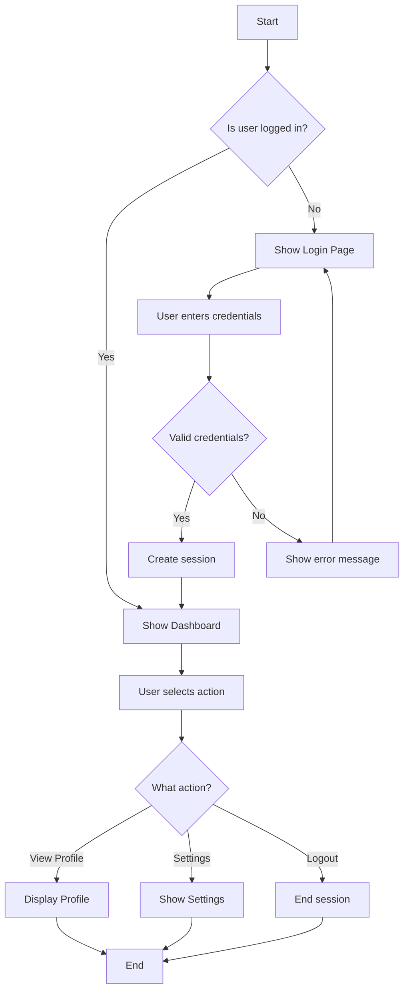

```mermaid
flowchart TD
    A[Start] --> B{Is user logged in?}
    B -->|Yes| C[Show Dashboard]
    B -->|No| D[Show Login Page]
    D --> E[User enters credentials]
    E --> F{Valid credentials?}
    F -->|Yes| G[Create session]
    F -->|No| H[Show error message]
    H --> D
    G --> C
    C --> I[User selects action]
    I --> J{What action?}
    J -->|View Profile| K[Display Profile]
    J -->|Settings| L[Show Settings]
    J -->|Logout| M[End session]
    K --> N[End]
    L --> N
    M --> N
```
